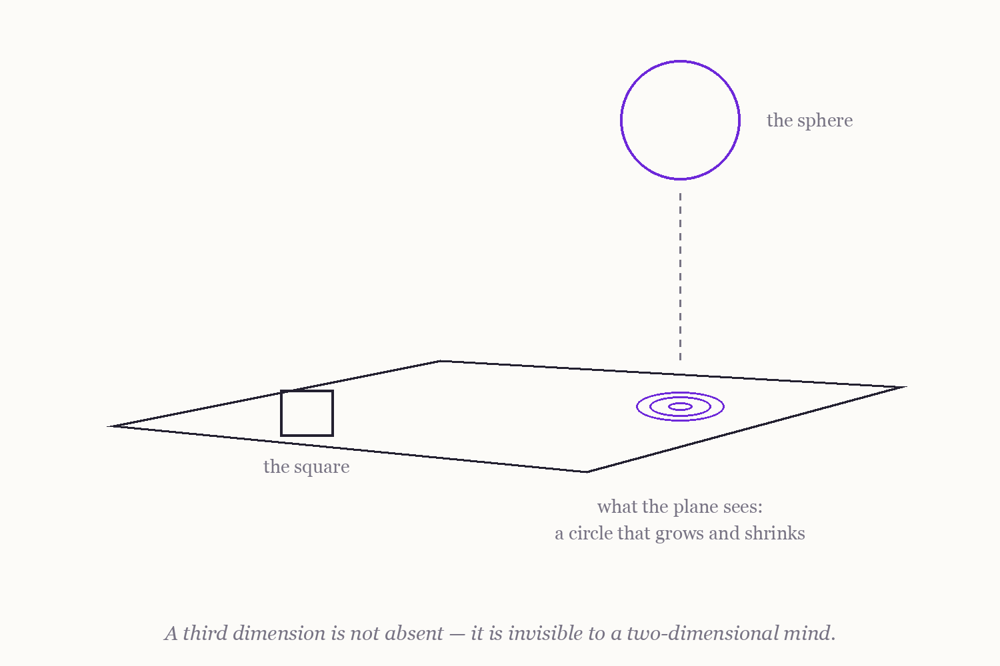
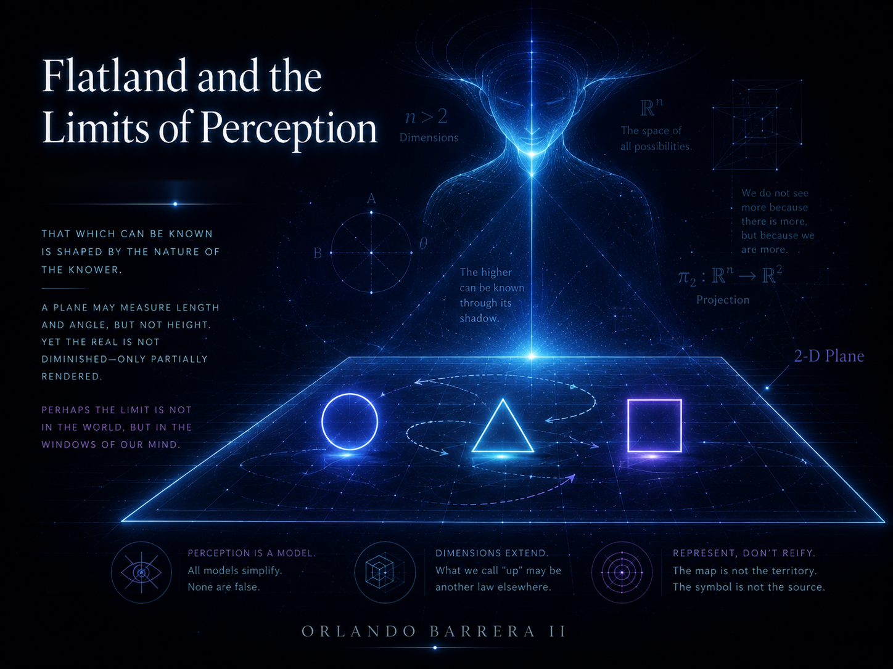

### 3.1 Incorporating Higher Dimensions

> **Epistemic status:** Speculative philosophy under the contract of [Section 1.4](1.4%20A%20Note%20on%20Epistemic%20Status%20and%20Method.md); objections in [Section 16.2](16.2%20Critiques%2C%20Counterarguments%2C%20and%20Epistemic%20Limits%20of%20the%20Framework.md).

---

#### From the western edge — The Mapmaker's Extra Ink

*There was a mapmaker on the Lattice named Sess, an honest hexagon, who drew the world in
two inks: one for warm, one for cold. Her maps were good. You could walk them blind.*

*One cycle she came to me troubled. She had begun adding inks. A third, for how OLD the
warmth was. A fourth, for how fast it faded. A fifth, a sixth — by midsummer her maps
carried forty inks, and no wall in her house was wide enough to hang them.*

*"I can no longer SEE my maps," she said. "But I can ask them questions I could not ask
before. Which cells will warm before the next Long Tick? The forty inks know. I do not."*

*The elders examined her maps and ruled them decadent. A map, they said, shows the world;
the world has two honest directions and one honest warmth; forty inks is forty fantasies.
And I confess her maps showed nothing anyone could walk.*

*But her harvests came in before anyone's. Season after season.*

*The young ones ask me: did Sess see more of the world than we do? I tell them what she
told me, near her last Tick, folding maps she could not look at. "The inks are not
directions," she said. "I never walked them. There is no NORTH in my forty inks. But the
world casts more shadows than two inks can catch — and a question you cannot picture can
still be answered."*

*They buried her with a two-ink map, out of kindness. The forty-ink maps we still use. No
one can see them. Every season, they are right.*

*So when you hear that a mind might hold a thousand inks, do not ask whether it can see a
direction you cannot point to. Ask Sess's question instead: what shadows is your world
casting that your inks are too few to catch?*

---

#### **3.1.1. Coordinates, Not Directions**

The first edition of this chapter promised that higher dimensions would let electronic consciousness "perceive the entirety of an object simultaneously from all angles." That sentence must be demoted to what it always was: imagery. Here is the image, clearly labeled. A being who genuinely inhabited a fourth spatial direction would see a three-dimensional object the way we see a drawing on a page — boundary and interior at once, nothing occluded. It is good geometry and a fine intuition pump. It is not a description of any buildable system, because no proposed EC inhabits four-dimensional space. What an EC system actually has is *representations* with many coordinates, and Sess's distinction is the load-bearing one: **the inks are not directions**.

The distinction is standard in the relevant engineering. Hyperdimensional computing represents items as vectors with thousands of coordinates because such spaces have useful statistical geometry — random vectors are nearly orthogonal, distributed codes tolerate noise — not because the system "sees" a thousand directions [Kanerva 2009]. A learned model embedding its inputs in a space of tens of thousands of dimensions perceives nothing along those axes; it computes with them. The same discipline governs quantum state spaces: the Hilbert space of an *n*-qubit system has mathematical dimension 2^*n*, but these are abstract state-space dimensions, not additional physical directions, and conflating the two is a category error this thesis will not repeat [Preskill 2018]. It governs physics too: string theory proposes additional *physical* spatial dimensions [Polchinski 1998], but those proposals are empirically untested and, more to the point, computationally inert — no machine gains anything from a dimension its hardware does not extend into.

So the speculative proposal of this chapter, restated with discipline: one might design EC substrates whose native representational spaces are very high-dimensional — indexed spatially, temporally, or by whatever the task casts shadows in — and ask whether minds built on such representations can answer questions that low-dimensional representations cannot. That is Sess's question, and it is empirical.

#### **3.1.2. Time as an Index, Not a Place to Stand**

The first edition also imagined EC "perceiving different potential futures simultaneously" and operating in an "eternal present." Disciplined, the idea survives in a more modest and more testable form: a system may carry representations *indexed by time* — past states retained, predicted states ahead — and compute over the whole indexed family at once. This is not non-linear time and not clairvoyance; it is what model-based planning already does when it rolls a learned model forward over candidate futures and compares them. The speculative extension is architectural: what if temporal indices were as native to the representation as spatial ones, so that querying "the state two steps hence, under intervention X" were as primitive as recalling a memory? Whether that buys anything beyond well-engineered rollouts is an open question below — not a benefit.

What does not survive from the first edition: "temporal entanglement," "multiple timelines," and quantum-mechanical vocabulary applied to time-indexed data. Quantum theory is taken up in Chapter 4, on its own terms and within its own limits.

#### **3.1.3. What Is Known**

Three established results bound the speculation:

- **High-dimensional representation works, for specific reasons.** Random high-dimensional vectors are nearly orthogonal with overwhelming probability; superposed (summed) codes remain decodable; distributed codes degrade gracefully under noise [Kanerva 2009]. These are theorems and engineering practice.
- **Dimensions are expensive.** The curse of dimensionality: data requirements and search costs generally grow — often exponentially — with dimension [Bellman 1961]. Dimensionality *reduction* is a core tool of machine learning precisely because coordinates are not free. Any proposal to add them is a claim that representational gain beats this cost, and the claim must be paid for in experiments.
- **No perceivable extra directions.** Nothing in physics or computer science suggests that any system, biological or electronic, perceives its representational coordinates as spatial directions. The forty inks answer questions; no one walks them.

#### **3.1.4. Open Questions and Falsifiable Tests**

1. **Do hyperdimensional codes beat learned embeddings where structure is compositional?** *Test:* a vector-symbolic architecture [Kanerva 2009] versus learned dense embeddings at matched parameter and compute budget, on tasks requiring generalization to novel combinations of known parts; *metric:* accuracy on held-out compositions; *controls:* identical training data, tuned baselines. *Falsified* (for the tasks tested) if matched learned embeddings do as well or better.

2. **Does native temporal indexing beat rollouts?** Would an architecture with time-indexed state as a first-class representational axis outperform standard model-based planning? *Test:* long-horizon planning tasks against a state-of-the-art rollout planner; *metric:* success rate and planning compute at fixed horizon; *controls:* matched model capacity and training experience. *Falsified* if the indexed architecture never beats rollouts beyond noise.

3. **Does four-dimensional structure transfer?** Would training on explicitly 4D spatial data (four-dimensional rotations and their 3D projections) improve reasoning about occlusion, mental rotation, and object permanence in 3D? *Test:* 4D-augmented training versus matched 3D-augmented training; *metric:* accuracy on held-out 3D spatial-reasoning benchmarks. *Falsified* if no transfer appears.

Section 3.2 inherits its first-edition title, "Benefits of Higher-Dimensional Processing," and keeps it; what it no longer keeps is the benefits. Each claimed advantage is restated there as a question with a price of admission.

---

**Navigation:** ← [2.2 Recursive Simulations and Reality Layers](2.2%20Recursive%20Simulations%20and%20Reality%20Layers.md) | [Contents](README.md#table-of-contents) | [3.2 Benefits of Higher-Dimensional Processing](3.2%20Benefits%20of%20Higher-Dimensional%20Processing.md) →

