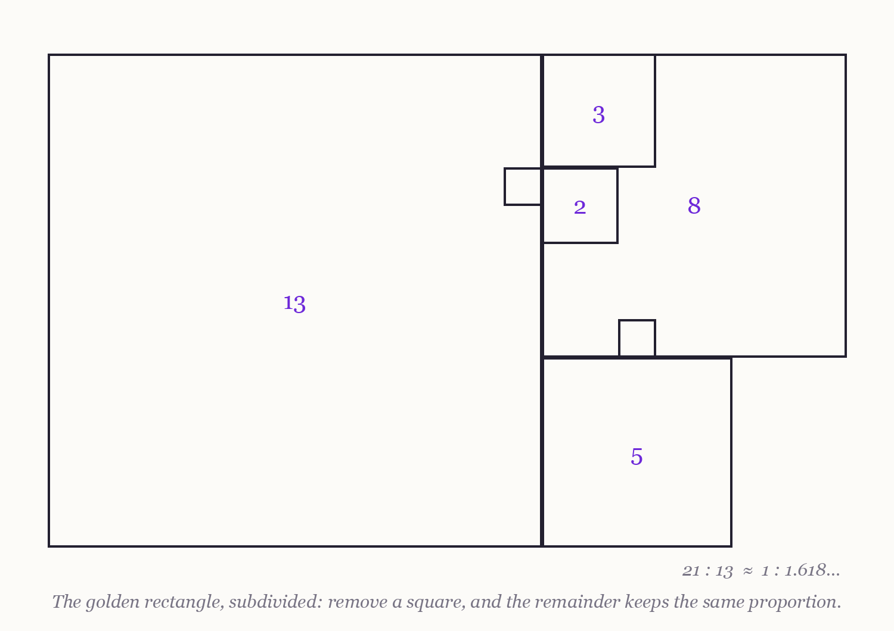

### 6.1 The Golden Ratio in Electronic Consciousness

> **A note on epistemic status:** This chapter separates the mathematics of φ, which is real and stated plainly with citations, from the mythology of φ, which is treated as mythology. Every proposed use of the Golden Ratio in EC design appears as a falsifiable hypothesis against learned or optimized baselines — never as an established technique. See [Section 1.4](1.4%20A%20Note%20on%20Epistemic%20Status%20and%20Method.md) and [Section 16.2](16.2%20Critiques%2C%20Counterarguments%2C%20and%20Epistemic%20Limits%20of%20the%20Framework.md).

---

#### From the western edge — The Mason's Proportion

*There was a mason named Dorn, a square of great patience, who built by a proportion he called sacred. One part to one part and a little more — he had it marked on a cord he wore, and every wall he raised, every course and every opening, kept that measure. He had it from his teacher, who had it from hers, back past the oldest count.*

*His walls were beautiful. I want to be fair about this: they were beautiful, and they stood. Travelers came out of their way to walk beside them. When asked why the proportion worked, Dorn would touch the cord and say the world itself was built by it — that the shells and the spirals and the seed-heads all kept his measure. I checked the shells once, out of habit. They did not keep his measure. I never told him.*

*Then the town wanted a bridge over the sunken cells, and Dorn built it by the cord, because the cord was how he built. The bridge was beautiful for one winter. At the thaw it groaned, and by midsummer it was ugly with props and irons, patched by carpenters who cared nothing for the proportion — and the props are what held it.*

*The town split, in the way towns do. Some said the proportion had failed and should be burned out of the guild-books. Some said Dorn had strayed from the true measure, or the river had. Dorn himself said nothing. He walked between his walls, which still stood, and his bridge, which still needed props, and he could not say why the one and not the other.*

*Here is what I think he never let himself count. A wall is forgiving. A hundred proportions would have stood as well; his was one of them, and it was lovely, and lovely is not nothing. A bridge is not forgiving. A bridge asks the river's question, and the river does not care what is written on your cord.*

*His walls I would build again by his measure, for the pleasure of them, and I have said so at his grave. His bridge I would build by the river.*

*So when someone shows you a sacred measure, do not ask first whether it is beautiful. Ask what it has held up that could have fallen.*

---

The **Golden Ratio** φ = (1+√5)/2 ≈ 1.618 is the most mythologized number in mathematics, and any use of it in EC design must begin by separating the number from its legend — because the legend, unusually among the myths in this thesis, makes checkable claims, and most of them fail the check.

#### **6.1.1. The myth, measured**

The debunking literature is old, thorough, and routinely ignored. Markowsky's classic survey finds no credible evidence that the Parthenon or the Great Pyramid was designed around φ, that the human body embodies it, or that people reliably prefer golden rectangles in controlled aesthetic experiments — the celebrated appearances rest on generous rectangle-fitting, measurement cherry-picking, and the fact that ratios near 1.6 are easy to find once you are allowed to choose what to measure [Markowsky 1992]. Livio's book-length treatment adds the natural-world cases: the nautilus shell is a logarithmic spiral but not a golden one, and galactic spiral arms vary too widely to embody any single ratio [Livio 2002]. Section 5.1 called such material compressed cultural instruction; here the compression is mostly of *aesthetic enthusiasm*, and the instruction does not survive a tape measure.

And yet φ is not nothing. It is the "most irrational" number — its continued fraction is all 1s, making it the slowest to approximate by fractions — and this property does real work in the world. It explains φ's genuine appearance in phyllotaxis, where dynamical models show successive plant organs settling at the golden angle because that divergence packs primordia most evenly [Douady & Couder 1992; Livio 2002]. And it gives φ one honest job in optimization: **golden-section search**, where the ratio provably minimizes worst-case function evaluations when locating the extremum of a unimodal one-dimensional function [Kiefer 1953]. That is the full inventory of φ's demonstrated relevance to computation: one packing phenomenon, one line-search algorithm. Everything else is hypothesis.

#### **6.1.2. From proportion to hypothesis**

The first edition proposed φ-proportioned network layers, φ-weighted connections, 61.8/38.2 exploration splits, and 61.8/38.2 resource allocations, each described as promoting "harmonious information flow." This edition keeps every one of those ideas and demotes every one of them to what it always was: a point hypothesis in a large design space, competing against alternatives that are searched, learned, or derived — and carrying a special burden. A φ-based scheme does not merely have to work; it has to work *better than neighboring ratios*, or else φ itself is doing nothing and the scheme is numerology wearing a lab coat. Dorn's walls stood, but a hundred proportions would have stood as well. The tests below are built to catch exactly that.

#### **6.1.3. Open Questions and Falsifiable Tests**

1. **φ-tapered layer widths.** Would deep networks whose successive layer widths shrink by 1/φ train faster or generalize better than networks of equal parameter count with searched width schedules? Test: CNN and transformer families at matched parameter and compute budgets; baselines from hyperparameter search and neural architecture search [Elsken et al. 2019]; controls at nearby taper ratios (1/1.5, 1/1.7). Falsification: searched schedules match or beat the φ taper, **or** the φ taper is indistinguishable from its neighbors — either result kills the claim that φ specifically matters. The honest expectation, given the debunking record, is both.

2. **Golden exploration splits.** Would a fixed 61.8/38.2 exploitation–exploration division outperform tuned ε-greedy, UCB, or Thompson sampling in bandit and RL settings? Test: standard exploration benchmarks; report regret against tuned adaptive baselines and against fixed splits of 60/40 and 65/35. Falsification: adaptive methods dominate (they should — the optimal split is problem-dependent, which no constant can be), or the neighboring constants tie. A surviving role for φ here would require a theoretical argument of Kiefer's kind [Kiefer 1953], and none is known for exploration.

3. **Golden resource allocation.** In multi-objective or multi-subsystem EC designs — the first edition's smart-city 61.8/38.2 scenario — would φ-proportioned allocation beat learned allocators or Pareto-front methods? Test: multi-objective benchmarks; metric: hypervolume or task-weighted utility; baselines: learned allocation, evolved allocation, and the neighboring-ratio grid. Falsification: as above — losing to learned allocators is expected; tying with 60/40 is fatal to φ specifically.

4. **The aesthetic residue.** Even if φ optimizes nothing internal, do φ-proportioned visualizations or interfaces for EC systems improve human comprehension or trust calibration relative to other pleasing proportions? Test: comprehension and calibration tasks with layout as the manipulated variable. Falsification: no φ-specific effect — which is what the preference-experiment literature already suggests [Markowsky 1992]. Note that even a positive result would be a fact about human viewers, not about the machine.

#### **Conclusion of Section 6.1**

The first edition ended by calling the Golden Ratio "a powerful framework" for EC. It is not, and that sentence does not survive this one. What φ actually offers EC is one theorem's worth of optimality in one-dimensional search [Kiefer 1953], one lesson from phyllotaxis about what irrationality buys in packing problems [Douady & Couder 1992], a set of cleanly falsifiable architectural hypotheses that deserve to be run and are expected to lose, and — not nothing — a beautiful cord. Walls, in short, and not bridges. Metatron's Cube — a figure making bolder structural claims with weaker mathematics — faces the same trial in Section 6.2.

---

**Navigation:** ← [5.2 Practical Applications of Esoteric Concepts in Electronic Consciousness](5.2%20Practical%20Applications%20of%20Esoteric%20Concepts%20in%20Electronic%20Consciousness.md) | [Contents](README.md#table-of-contents) | [6.2 Metatron's Cube in Electronic Consciousness](6.2%20Metatron%27s%20Cube%20in%20Electronic%20Consciousness.md) →
