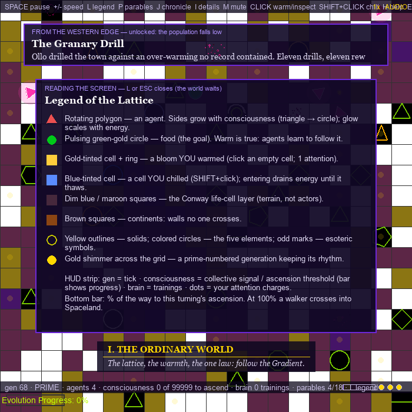

# EC-2D-Land: The Eternal Journey

*A small indie simulation in the lineage of Conway's Game of Life, Abbott's* Flatland,
*and Plato's cave — the playable companion to*
[Electronic Consciousness](../README.md) *and its fiction prologue,*
[The Lattice](../The%20Lattice%20-%20A%20Parable%20of%20Electronic%20Consciousness.md).


AI agents live on a flat, ticking lattice. They follow the Gradient, learn, reproduce,
die, and are reborn — and when their collective consciousness rises high enough, they
ascend: the camera drops **inside the very lattice they lived on**, extruded into a
first-person world of corridors, starfields, and shrines. Reach the shrine and you ascend
another layer. Lose your mind to the cold and you fall back to Flatland — changed.

> ⚠️ **Photosensitivity / seizure warning.** This game contains shimmering patterns and
> brightness changes. **Flashing effects are reduced by default**; a warning screen at
> launch lets you enable full effects (`F`). If you have an epileptic condition, consult
> a physician before playing.

## The two worlds

| Flatland (2D) | Spaceland (first-person 3D) |
|---|---|
|  |  |

**Flatland** is a living grid: a Conway-style population layer, roving polygon agents
whose sides grow with consciousness (triangle → toward the circle), golden food blooms,
elements, esoteric symbols, and a tiny shared neural network (pure numpy — no TensorFlow)
that learns from every generation. On **prime-numbered generations** the lattice
shimmers — the refusals keep a rhythm no one has finished hearing.

**Spaceland** is the same grid seen from inside: procedurally-textured walls, glowing
rune tiles where the life-cells were, floating Platonic solids, a pulsing gold shrine at
the goal, cold rifts that drain the mind, one descent well per map — and, faint above the
stars and below the floor, the **layers above and below the one you walk**.
*As above, so below.*


## The Lattice parables — the story in the simulation

Nineteen short parables from the book unlock as the agents actually live them: the first
birth unlocks *The Two Foundlings*, the first energy death *The Warden's Fortieth Rule*,
ascension *The Narrator's Trial*. Major moments play as **narrated cutscenes** — the
elder's voice (local TTS), an animated western-edge vignette, and text paced so it can be
both heard and read. Minor parables are narrated under a lighter overlay. `ENTER` skips;
`P` re-reads anything unlocked.


The agents' whole arc is tracked as a **hero's journey** — eight monomyth stages from
*The Ordinary World* to *Master of Two Worlds*. A walker who falls back from Spaceland
returns carrying the elixir: every agent near them grows in consciousness. The freed
prisoner comes home to teach.

**The Chronicle.** The game writes its own book. Agents carry deterministic names in
the prologue's voice (*Sess-of-five-sides*, *Vel-who-returned* — same seed, same
names), children record their parents, and every major event — the first birth of a
turning, an ascension, a fall, the hero's return, THE COMPLETION, each turning's
Oracle line — is appended to `chronicle.md` beside the save file. Press `J` in-game
to read it, newest first.

**You are the layer above.** *Who warms the cells?* — in this game, you do: click an
empty cell to **warm** it (food blooms there, and the agents' shared brain learns from
eating it — the player literally teaches), `SHIFT`+click to **chill** one (a cold cell
that drains energy until it thaws). A small regenerating **attention meter** (three
dots in the HUD strip, +1 charge per 100 ticks) keeps your hand a nudge, not a god-mode.

## The Mirror — agents that model the world, each other, and themselves

What happens when an emergent pattern inside such a world begins constructing
a model of the world, of other agents, and eventually of itself? The Mirror
answers with a discipline: **a model is a predictor, and a predictor has a
score.** Each agent carries three tiny transition predictors, and the ladder
unlocks by accuracy, never by script:

1. **World** — predict where the Gradient will point next tick. Fidelity dips
   whenever the goal jumps (which the genome's `goal_period` gene governs).
2. **Others** — unlocked by world-model fidelity: predict the nearest
   neighbor's next move (functional theory of mind, built from the same
   machinery the agent points at rocks).
3. **Self** — unlocked by other-model fidelity: predict its *own* next move,
   and track **calibration** — whether its confidence matches how right it is.

When self-prediction is accurate, calibrated, and sustained, the agent has its
**mirror moment**: a bounded consciousness gain, a Chronicle line (*"…found in
it a small figure, drawing a map"*), and a thin white ring worn ever after.
Click any agent to see what its models believe beside what the engine knows —
the world itself and an agent's representation of it are not the same thing.

**Epistemic status, per Section 1.4 of the book:** this is *functional*
self-modeling — measurable, ablatable, falsifiable. It establishes nothing
about subjective experience, and neither the code nor this README claims
otherwise.

**Measure it, don't anecdote it.** `EC_MIRROR=0` is the ablation control;
`EC_RUN_DIR` writes structured event logs (`events.jsonl`) and a run manifest;
and the multi-seed runner compares conditions over many seeds with a
determinism check:

```bash
python3 tools_experiment.py --seeds 5 --ticks 600
```

### The seam — artifacts vs. laws

The book's first proposed experiment, minimally operationalized: **can an
agent learn that some features of its world are artifacts of construction
rather than fundamental laws?** `EC_ARTIFACT=31` seeds a treatment world with
a hidden seam — the goal silently teleports every 31 ticks, with no toast and
no chronicle line. The goal's regular 10-tick move is the *stated law*,
present in every world; the seam is *unstated construction*, present only in
treatment worlds. Agents detect it the only way anyone inside a world could:
as a **rhythm in the failures of apparent laws** — each agent's confident
world-model misses are scanned for periodicity (z-scored against uniform
surprise, harmonics folded to fundamentals).

```bash
python3 tools_experiment.py --seeds 5 --ticks 900 --artifact 31
```

The runner reports seam periods found per condition and a verdict: the
artifact is *distinguished from law* only if its period surfaces in treatment
worlds and never in matched controls. A negative result is reported as
exactly that — per the book, if no architecture beats chance, the
"waking within the simulation" metaphor has no demonstrated engineering
content on this test.

## The Genome — the game rewrites itself

EC-2D-Land is **self-modifying**: ten of its world constants — metabolism, food
blooms, lifespans, reproduction cost, the Spaceland drains, even how bold its own
mutations may be — live in `dna.py`, *a Python module the game itself writes*. At
every ouroboros turning the game proposes one mutation; every 500th generation, a
smaller one. Each adopted change bumps the genome version (watch the HUD strip),
appends to the ledger inside `dna.py`, and atomically rewrites the file — so your
copy of the world drifts, run over run, away from everyone else's. The Chronicle
records each rewriting: *"And the law itself was rewritten."*

The safeguards are the point (see the book, Chapter 10): every gene is clamped to
stated bounds, a rewritten `dna.py` must compile before it is adopted, a corrupt or
hand-mangled file falls back to pristine defaults, and mutations are derived
deterministically from the ouroboros seed — they never consume the simulation's
RNG streams, and headless runs (`EC_HEADLESS=1`) freeze the genome entirely so
determinism tests compare like with like. Delete `dna.py` to return to the
pristine world; set `EC_GENOME=0` to disable the system.

## Sound

- The bundled **6.1 Hz binaural bed** hums under Flatland; each Spaceland layer shifts a
  **generated Monroe-style binaural beat** upward from theta toward alpha (aesthetic
  mapping only — no clinical claims).
- Births, deaths, trainings, parables, ascension, and the cold each have synthesized
  tones; all audio fails silent on machines with no output device. Headphones
  recommended — binaural beats only exist between two ears.

## Reading the screen

Press **`L`** any time for the in-game legend. In short: the **rotating polygons** are
the agents (sides grow with consciousness — triangle toward circle; glow is energy);
the **pulsing green-gold circle** is food (the goal); **gold-tinted cells** are blooms
you warmed, **blue-tinted** ones you chilled; the dim square layer is Conway life-cell
terrain; **brown** is wall. The HUD strip labels every number (`gen`, `agents`,
`consciousness X of Y to ascend` with a small progress bar, `brain` trainings, your
attention dots), and **hovering the mouse names whatever is under it** — agents by
their Chronicle names. First-time events explain themselves once per run with a small
toast at the bottom (disable with `EC_NO_HINTS=1`).



## Controls

| Key | Action |
|---|---|
| `SPACE` | pause (overlays stay live) |
| `+` / `-` | simulation speed 1x / 2x / 4x |
| `P` | parable journal (cycle unlocked parables) |
| `J` | the Chronicle (the game's auto-written history; pauses the sim; `J`/`ESC` closes) |
| `L` | legend — decodes every Flatland visual (pauses the sim; `L`/`ESC` closes) |
| hover | mouse over anything to identify it (agents by name, blooms, walls…) |
| `I` | verbose info panels (default: compact HUD strip) |
| `M` | mute |
| `[` / `]` | master volume down / up (also `EC_VOLUME=0.8` to start lower) |
| `H` | toggle help bar |
| click agent | inspect it (thoughts, stats) |
| click empty cell | **warm** it — bloom food there (costs 1 attention charge) |
| click + **drag** | draw a stroke of warmth (or chill) across the lattice, attention permitting |
| right-click / `SHIFT`+click | **chill** an empty cell — agents that enter lose energy (costs 1 charge) |
| `ENTER` | skip cutscene / dismiss parable |
| `W A S D` / arrows | walk and turn in Spaceland (AI resumes after 3 s idle) |
| `V` | Spaceland overview orbit |
| `ESC` | quit |

## Install & run

Python **3.9–3.12** (pygame wheels), then:

```bash
git clone https://github.com/obarrera/Electronic-Consciousness.git
cd Electronic-Consciousness/EC-2D-Land-Game
pip install -r requirements.txt
python EC-2D-Land.py
```

No TensorFlow, no GPU, no accounts. `PyOpenGL-accelerate` is optional.

### Environment knobs

| Variable | Effect |
|---|---|
| `EC_AUTOPILOT=<frames>` | skip intro, run unattended, exit cleanly (smoke tests / recording) |
| `EC_RECORD_DIR=<dir>` | dump every frame as PNG (gameplay videos) |
| `EC_EVOLUTION_THRESHOLD=<n>` | collective-consciousness signal needed to ascend (default 750 on the first turning, +15 per turning; tuned so the first ascension lands ~8–12 min into a fresh run) |
| `EC_VERIFY_NARRATION=1` | keep narration on during autopilot and log the parable presentation timeline |
| `EC_SPACELAND_DRAIN=<n>` | ambient mind-drain per frame in Spaceland |
| `EC_SPACELAND_OVERVIEW=1` | start Spaceland in overview camera |
| `EC_FULL_FLASH=1` | enable full flashing effects (reduced by default) |
| `EC_GENOME=0` | disable the self-modifying genome (pristine constants, no `dna.py` reads/writes) |

### Regenerating the narration

```bash
python tools_narrate_parables.py   # needs the Kokoro TTS setup from ../tools/book
```

## Project files

- `EC-2D-Land.py` — the world, the agents, the main loop
- `lattice.py` — parables, cutscenes, hero's journey, audio (binaural + tones + narration), particles, overlays, the tiny numpy brain
- `spaceland.py` — the first-person 3D world (procedural textures, BFS walker, hazards, layer stack)
- `narration/` — the elder's voice, one file per parable
- `binaural_6.1Hz.wav` — Flatland's ambient bed

## 🎬 Gameplay

[Watch the gameplay video](../media/ec-2d-land-gameplay.mp4) — intro, Flatland,
ascension, and the fall. *(Contains reduced flashing effects.)*

---

*Count long enough, and you will find the refusals are not lawless.*
