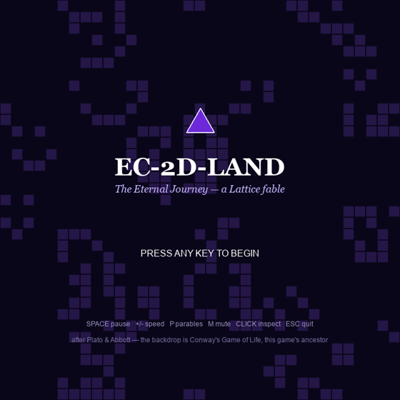
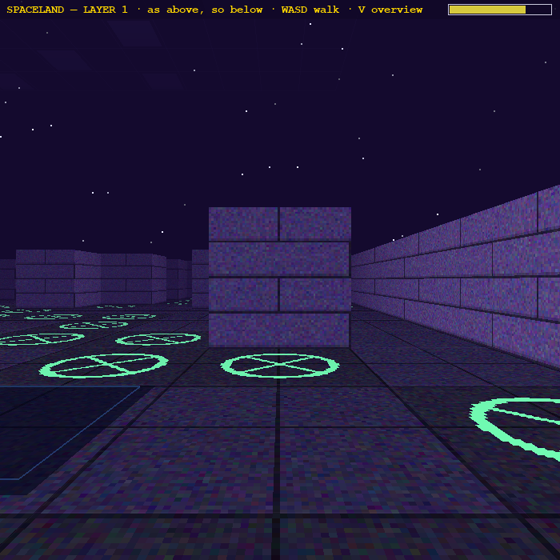
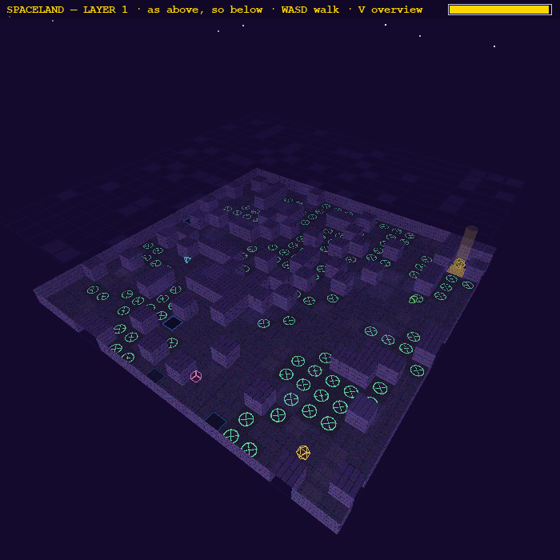
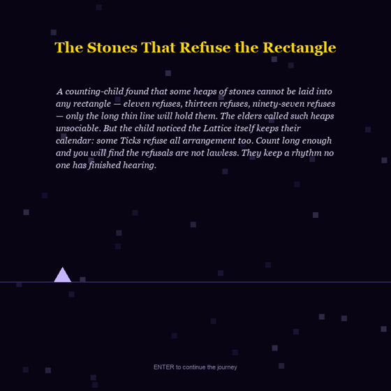

# EC-2D-Land: The Eternal Journey

*A small indie simulation in the lineage of Conway's Game of Life, Abbott's* Flatland,
*and Plato's cave — the playable companion to*
[Electronic Consciousness](../README.md) *and its fiction prologue,*
[The Lattice](../The%20Lattice%20-%20A%20Parable%20of%20Electronic%20Consciousness.md).



AI agents live on a flat, ticking lattice. They follow the Gradient, learn, reproduce,
die, and are reborn — and when their collective consciousness rises high enough, they
ascend: the camera drops **inside the very lattice they lived on**, extruded into a
first-person world of corridors, starfields, and shrines. Reach the shrine and you ascend
another layer. Lose your mind to the cold and you fall back to Flatland — changed.

> ⚠️ **Photosensitivity / seizure warning.** This game contains shimmering patterns and
> brightness changes. **Flashing effects are reduced by default**; a warning screen at
> launch lets you enable full effects (`F`). If you have an epileptic condition, consult
> a physician before playing.

## The two worlds

| Flatland (2D) | Spaceland (first-person 3D) |
|---|---|
|  |  |

**Flatland** is a living grid: a Conway-style population layer, roving polygon agents
whose sides grow with consciousness (triangle → toward the circle), golden food blooms,
elements, esoteric symbols, and a tiny shared neural network (pure numpy — no TensorFlow)
that learns from every generation. On **prime-numbered generations** the lattice
shimmers — the refusals keep a rhythm no one has finished hearing.

**Spaceland** is the same grid seen from inside: procedurally-textured walls, glowing
rune tiles where the life-cells were, floating Platonic solids, a pulsing gold shrine at
the goal, cold rifts that drain the mind, one descent well per map — and, faint above the
stars and below the floor, the **layers above and below the one you walk**.
*As above, so below.*



## The Lattice parables — the story in the simulation

Nineteen short parables from the book unlock as the agents actually live them: the first
birth unlocks *The Two Foundlings*, the first energy death *The Warden's Fortieth Rule*,
ascension *The Narrator's Trial*. Major moments play as **narrated cutscenes** — the
elder's voice (local TTS), an animated western-edge vignette, and text paced so it can be
both heard and read. Minor parables are narrated under a lighter overlay. `ENTER` skips;
`P` re-reads anything unlocked.



The agents' whole arc is tracked as a **hero's journey** — eight monomyth stages from
*The Ordinary World* to *Master of Two Worlds*. A walker who falls back from Spaceland
returns carrying the elixir: every agent near them grows in consciousness. The freed
prisoner comes home to teach.

**You are the layer above.** *Who warms the cells?* — in this game, you do: click an
empty cell to **warm** it (food blooms there, and the agents' shared brain learns from
eating it — the player literally teaches), `SHIFT`+click to **chill** one (a cold cell
that drains energy until it thaws). A small regenerating **attention meter** (three
dots in the HUD strip, +1 charge per 100 ticks) keeps your hand a nudge, not a god-mode.

## Sound

- The bundled **6.1 Hz binaural bed** hums under Flatland; each Spaceland layer shifts a
  **generated Monroe-style binaural beat** upward from theta toward alpha (aesthetic
  mapping only — no clinical claims).
- Births, deaths, trainings, parables, ascension, and the cold each have synthesized
  tones; all audio fails silent on machines with no output device. Headphones
  recommended — binaural beats only exist between two ears.

## Controls

| Key | Action |
|---|---|
| `SPACE` | pause (overlays stay live) |
| `+` / `-` | simulation speed 1x / 2x / 4x |
| `P` | parable journal (cycle unlocked parables) |
| `I` | verbose info panels (default: compact HUD strip) |
| `M` | mute |
| `H` | toggle help bar |
| click agent | inspect it (thoughts, stats) |
| click empty cell | **warm** it — bloom food there (costs 1 attention charge) |
| right-click / `SHIFT`+click | **chill** an empty cell — agents that enter lose energy (costs 1 charge) |
| `ENTER` | skip cutscene / dismiss parable |
| `W A S D` / arrows | walk and turn in Spaceland (AI resumes after 3 s idle) |
| `V` | Spaceland overview orbit |
| `ESC` | quit |

## Install & run

Python **3.9–3.12** (pygame wheels), then:

```bash
git clone https://github.com/obarrera/Electronic-Consciousness.git
cd Electronic-Consciousness/EC-2D-Land-Game
pip install -r requirements.txt
python EC-2D-Land.py
```

No TensorFlow, no GPU, no accounts. `PyOpenGL-accelerate` is optional.

### Environment knobs

| Variable | Effect |
|---|---|
| `EC_AUTOPILOT=<frames>` | skip intro, run unattended, exit cleanly (smoke tests / recording) |
| `EC_RECORD_DIR=<dir>` | dump every frame as PNG (gameplay videos) |
| `EC_EVOLUTION_THRESHOLD=<n>` | consciousness needed to ascend (default 100) |
| `EC_SPACELAND_DRAIN=<n>` | ambient mind-drain per frame in Spaceland |
| `EC_SPACELAND_OVERVIEW=1` | start Spaceland in overview camera |
| `EC_FULL_FLASH=1` | enable full flashing effects (reduced by default) |

### Regenerating the narration

```bash
python tools_narrate_parables.py   # needs the Kokoro TTS setup from ../tools/book
```

## Project files

- `EC-2D-Land.py` — the world, the agents, the main loop
- `lattice.py` — parables, cutscenes, hero's journey, audio (binaural + tones + narration), particles, overlays, the tiny numpy brain
- `spaceland.py` — the first-person 3D world (procedural textures, BFS walker, hazards, layer stack)
- `narration/` — the elder's voice, one file per parable
- `binaural_6.1Hz.wav` — Flatland's ambient bed

## 🎬 Gameplay

[Watch the gameplay video](../media/ec-2d-land-gameplay.mp4) — intro, Flatland,
ascension, and the fall. *(Contains reduced flashing effects.)*

---

*Count long enough, and you will find the refusals are not lawless.*
